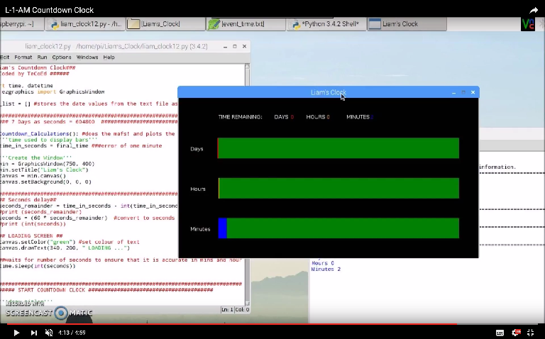

# L-I-A-M-Countdown-Clock
_Countdown clock for events_

Created this countdown clock for a work friend's son who has SEN and struggles to understand time.  Ingeniously they used a stack of seven Lego bricks to represent a week but, need something more accurate.

#Dependencies:
+ Python 3
+ EzGraphics
+ Built to run on a Raspberry Pi 3 

Download EzGraphics here: http://www.ezgraphics.org/Software/Download
(Place into the same folder as your L-1-AM program, no installation required)

# How to use:
1. Download the Final_Code folder and contents
2. Open the event_time text file
3. Set the date, month, hour and minutes to your required time
4. Open the main LIAM_Clock program and run
5. The program will display a countdown - updates every minutes
6. Since the time is calculated in real time you can turn device / computer / Pi off and the time is recalculated next time you power up.

_(Time can be set for a future date, up to 7 days)_

See the code in action here: https://www.youtube.com/watch?v=9hokFa0RaUY
